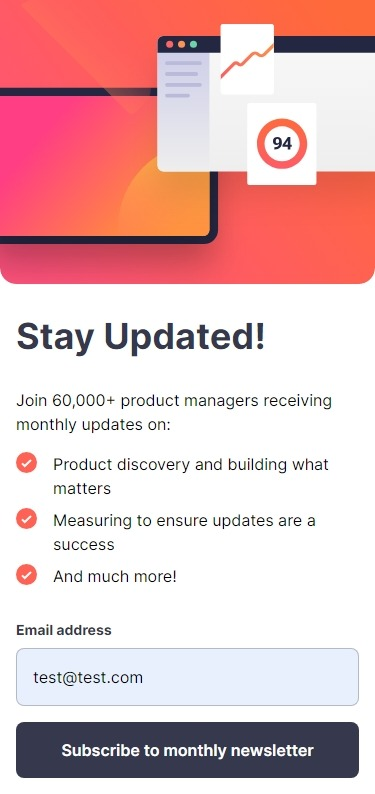

# Frontend Mentor - Newsletter sign-up form with success message solution

  

This is a solution to the [Newsletter sign-up form with success message challenge on Frontend Mentor](https://www.frontendmentor.io/challenges/newsletter-signup-form-with-success-message-3FC1AZbNrv). Frontend Mentor challenges help you improve your coding skills by building realistic projects.

  

## Table of contents

  

- [Overview](#overview)

	- [The challenge](#the-challenge)

	- [Screenshot](#screenshot)

	- [Links](#links)

- [My process](#my-process)

	- [Built with](#built-with)

	- [What I learned](#what-i-learned)

	- [Continued development](#continued-development)

	- [Useful resources](#useful-resources)

- [Author](#author)

- [Acknowledgments](#acknowledgments)

  

  

## Overview

  

### The challenge

  

Users should be able to:

  

- Add their email and submit the form

- See a success message with their email after successfully submitting the form

- See form validation messages if:

	- The field is left empty

	- The email address is not formatted correctly

- View the optimal layout for the interface depending on their device's screen size

- See hover and focus states for all interactive elements on the page

  

### Screenshot

  



  


### Links

  

- Solution URL: [Solution](https://www.frontendmentor.io/solutions/newsletter-signup-form-using-nextjs-and-typescript-tJWtVpKqiz)
- Live Site URL: [Vercel](https://newsletter-sign-up-form-with-success-message-next-js.vercel.app/)

  

## My process

  

### Built with

  

- Mobile-first workflow

- [React](https://reactjs.org/) - JS library

- [Next.js](https://nextjs.org/) - React framework
- [Tailwind CSS](https://tailwindcss.com/)
- TypeScript

  

  

### What I learned

  - Because NextJS can only receive params, this is how both Child and Parent declare props:

```js
///Child
interface Props {
	params: {
		email: string;
		onEmailChange: Dispatch<SetStateAction<string>>;
	}
}

export  default  function Page({params}: Props) {
	const {email, onEmailChange} = params;

	return (
		///JSX element here
	)
}

///Parent
export  default  function Page() {
	const [email, setEmail] = useState('')

	return (
		<>
			{email == '' ? (<Home  params={{onEmailChange: setEmail, email: email}}  />) : (<Confirmed  params={{onEmailChange: setEmail, email: email}}  />)}
		</>
	);
}
```

- Type on Form Event, Form Input, and such as:
```js
const submitForm = (e: React.FormEvent<HTMLFormElement>) => {
	e.preventDefault()
	
	onEmailChange((e.currentTarget.email as HTMLInputElement).value)
}
```


### Continued development

  - Using TypeScript for the next projects
  - Writing clean TypeScript code
  - Using TypeScript with React

  

  

### Useful resources

  

- Difference between onSubmit and action in form: [javascript - Can someone explain the difference between onsubmit and action? - Stack Overflow](https://stackoverflow.com/questions/74931828/can-someone-explain-the-difference-between-onsubmit-and-action#:~:text=onsubmit()%20contains%20JavaScript%20that,data%20to%20the%20action%20URL.)
- How to pass params to a React Component with TypeScript: [File Conventions: page.js | Next.js (nextjs.org)](https://nextjs.org/docs/app/api-reference/file-conventions/page)

- Basic but I always need to refer to this every time I want to share state or lifting it up: [Sharing State Between Components – React](https://react.dev/learn/sharing-state-between-components#lifting-state-up-by-example)

  


  

## Author

  

- Website - [Taufiq Mahdi Portfolio](https://taufiqmahdi-personal-portfolio.vercel.app/)


- Frontend Mentor - [@taufiqmahdi](https://www.frontendmentor.io/profile/taufiqmahdi)
- Twitter - [@taufiqmhdi](https://www.twitter.com/taufiqmhdi)
  

  
